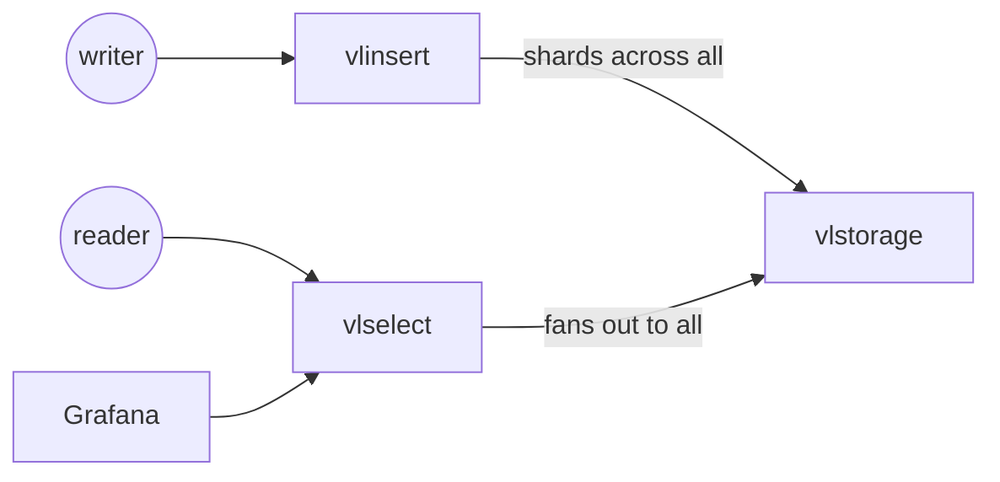

# victorialogs-sandbox / cluster

A VictoriaLogs cluster on Docker Compose: **3 vlstorage**, **3 vlinsert**,
**3 vlselect**, and Grafana for log search. Every VictoriaLogs role runs the
same binary. A node given `-storageNode` acts as vlinsert and vlselect at once,
so this sandbox narrows each one to a single role with `-select.disable` or
`-insert.disable`, and a node without `-storageNode` is a vlstorage.

The external contract is two endpoint groups on loopback: write through any
vlinsert, read through any vlselect. The vlstorage nodes are deliberately not
published to the host, so anything a client does has to go through the same
paths a production cluster would expose.

## Topology



| Role | Nodes | Host HTTP |
|------|-------|-----------|
| vlinsert | vlinsert-0..2 | 127.0.0.1:9481-9483 |
| vlselect | vlselect-0..2 | 127.0.0.1:9471-9473 |
| vlstorage | vlstorage-0..2 | (none) |
| Grafana | grafana | 127.0.0.1:3000 |

- vlinsert spreads incoming logs evenly across the three vlstorage nodes,
  and vlselect fans each query out to all three and merges the results.
- Host port bases follow the upstream cluster docs convention, 948x for
  insert and 947x for select. Inside the network every node listens on the
  default 9428.
- Grafana provisions a
  [VictoriaLogs datasource](config/grafana/provisioning/datasources/victorialogs.yaml)
  pointed at vlselect-0 and allows anonymous admin access. The other two
  vlselect nodes are for querying directly from the host.

## Quick start

```
docker compose up -d
```

Write a log line through a vlinsert node. The explicit Content-Type matters:
the HTTP server reads a form-encoded POST body as request parameters (that is
how the select queries below work), so without it the jsonline body arrives
empty and the insert is a silent no-op with HTTP 200:

```
curl -X POST 'http://127.0.0.1:9481/insert/jsonline' \
  -H 'Content-Type: application/stream+json' \
  -d '{"_msg":"hello victorialogs","service":"demo"}'
```

Read it back through a vlselect node:

```
curl 'http://127.0.0.1:9471/select/logsql/query' -d 'query=service:demo'
```

Then open http://127.0.0.1:3000/ and use Explore with the VictoriaLogs
datasource. The same `service:demo` LogsQL query returns the line.

## Operations

```
# seed 100k labeled log lines (100 streams x 1000) over the trailing 24h,
# a one-shot batch into the default tenant
docker compose run --rm vlogsgenerator
curl 'http://127.0.0.1:9471/select/logsql/query' -d 'query=host:host_42 | count()'

# every vlinsert accepts writes and every vlselect answers queries
curl -X POST 'http://127.0.0.1:9482/insert/jsonline' \
  -H 'Content-Type: application/stream+json' -d '{"_msg":"via vlinsert-1"}'
curl 'http://127.0.0.1:9473/select/logsql/query' -d 'query=*'

# the disabled role answers HTTP 400
curl 'http://127.0.0.1:9481/select/logsql/query' -d 'query=*'

# stop one vlstorage: queries return the rows held by the surviving nodes
# plus an error naming the unreachable storage node
docker compose stop vlstorage-1
curl 'http://127.0.0.1:9471/select/logsql/query' -d 'query=*'
docker compose start vlstorage-1
```

## Scope

Learning and rehearsal only. TLS and authentication are disabled, and all
nodes run on a single host. Logs are sharded across the vlstorage nodes
without replication, which is the cluster's own design: losing a vlstorage
node makes its shard unavailable until the node returns. A production setup
needs TLS between components, authentication in front of the insert and
select endpoints, and high availability from a second independent cluster
receiving the same log stream, not from settings inside this one.
