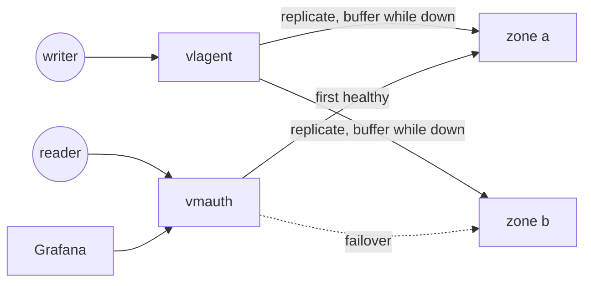

# victorialogs-sandbox / ha

VictoriaLogs keeps no replicas inside a cluster: vlinsert shards, and a lost
vlstorage node means a lost shard until it returns. Availability is built a
layer above, from independent instances that each receive the full log stream.
This case runs that layer: **two independent zones**, a **replicating write
path** (vlagent), and a **failing-over read path** (vmauth).

## Topology



| Role | Nodes | Host HTTP |
|------|-------|-----------|
| write entry | vlagent | 127.0.0.1:9481 |
| read entry | vmauth | 127.0.0.1:9471 |
| zone a | vlstorage-a, vlinsert-a, vlselect-a | select 9472, insert 9482 |
| zone b | vlstorage-b, vlinsert-b, vlselect-b | select 9473, insert 9483 |
| Grafana | grafana | 127.0.0.1:3000 |

- vlagent accepts the same ingestion endpoints as VictoriaLogs and replicates
  every line to both zones. For a zone that is down it buffers to disk
  ([`-remoteWrite.tmpDataPath`](docker-compose.yaml)) and replays on return.
- vmauth answers each query from the first healthy zone
  ([`config/vmauth`](config/vmauth), `first_available` with retries on 5xx).
- Each zone is a minimal 1+1+1 cluster. The inside of a production-shaped
  zone is the [cluster](../cluster/) case's story.
- Grafana reads through vmauth, so losing a zone does not change what the UI
  shows.
- Host ports keep the cluster case's meaning: 9471 = read, 9481 = write.

## Quick start

```
docker compose up -d
```

Write through vlagent, read through vmauth (the explicit Content-Type matters,
a form-encoded body would be read as request parameters):

```
curl -X POST 'http://127.0.0.1:9481/insert/jsonline' \
  -H 'Content-Type: application/stream+json' \
  -d '{"_msg":"hello victorialogs","service":"demo"}'

curl 'http://127.0.0.1:9471/select/logsql/query' -d 'query=service:demo'
```

Both zones hold the full stream, so the same query against 9472 (zone a) and
9473 (zone b) returns the same result.

## The rehearsal: losing a zone

```
# take zone b down
docker compose stop vlstorage-b vlinsert-b vlselect-b

# writes still land (zone a) and buffer for zone b
curl -X POST 'http://127.0.0.1:9481/insert/jsonline' \
  -H 'Content-Type: application/stream+json' \
  -d '{"_msg":"written during the outage","service":"demo"}'

# reads still answer, served by zone a
curl 'http://127.0.0.1:9471/select/logsql/query' -d 'query=* | count()'

# bring zone b back: vlagent replays the buffer and the zones converge
docker compose start vlstorage-b vlinsert-b vlselect-b
curl 'http://127.0.0.1:9472/select/logsql/query' -d 'query=* | count()'
curl 'http://127.0.0.1:9473/select/logsql/query' -d 'query=* | count()'

# read failover: with zone a down, vmauth serves from zone b
docker compose stop vlselect-a
curl 'http://127.0.0.1:9471/select/logsql/query' -d 'query=* | count()'
docker compose start vlselect-a
```

## Scope

Learning and rehearsal only. Both zones share one host, so this rehearses the
mechanics of replication, buffering, and failover, not the fault independence
that separate failure domains provide. TLS and authentication are disabled,
and the vlagent disk buffer is unbounded (`-remoteWrite.maxDiskUsagePerURL`
is unset).
